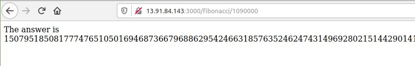
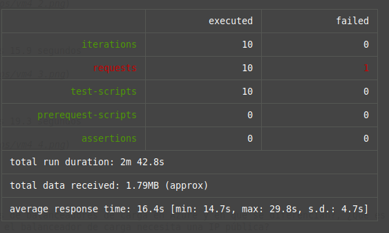

### Escuela Colombiana de Ingeniería
### Arquitecturas de Software - ARSW

## Escalamiento en Azure con Maquinas Virtuales, Sacale Sets y Service Plans

### Dependencias
* Cree una cuenta gratuita dentro de Azure. Para hacerlo puede guiarse de esta [documentación](https://azure.microsoft.com/en-us/free/search/?&ef_id=Cj0KCQiA2ITuBRDkARIsAMK9Q7MuvuTqIfK15LWfaM7bLL_QsBbC5XhJJezUbcfx-qAnfPjH568chTMaAkAsEALw_wcB:G:s&OCID=AID2000068_SEM_alOkB9ZE&MarinID=alOkB9ZE_368060503322_%2Bazure_b_c__79187603991_kwd-23159435208&lnkd=Google_Azure_Brand&dclid=CjgKEAiA2ITuBRDchty8lqPlzS4SJAC3x4k1mAxU7XNhWdOSESfffUnMNjLWcAIuikQnj3C4U8xRG_D_BwE). Al hacerlo usted contará con $200 USD para gastar durante 1 mes.

### Parte 0 - Entendiendo el escenario de calidad

Adjunto a este laboratorio usted podrá encontrar una aplicación totalmente desarrollada que tiene como objetivo calcular el enésimo valor de la secuencia de Fibonnaci.

**Escalabilidad**
Cuando un conjunto de usuarios consulta un enésimo número (superior a 1000000) de la secuencia de Fibonacci de forma concurrente y el sistema se encuentra bajo condiciones normales de operación, todas las peticiones deben ser respondidas y el consumo de CPU del sistema no puede superar el 70%.

### Parte 1 - Escalabilidad vertical

1. Diríjase a el [Portal de Azure](https://portal.azure.com/) y a continuación cree una maquina virtual con las características básicas descritas en la imágen 1 y que corresponden a las siguientes:
    * Resource Group = SCALABILITY_LAB
    * Virtual machine name = VERTICAL-SCALABILITY
    * Image = Ubuntu Server 
    * Size = Standard B1ls
    * Username = scalability_lab
    * SSH publi key = Su llave ssh publica


2. Para conectarse a la VM use el siguiente comando, donde las `x` las debe remplazar por la IP de su propia VM.

    `ssh scalability_lab@xxx.xxx.xxx.xxx`

3. Instale node, para ello siga la sección *Installing Node.js and npm using NVM* que encontrará en este [enlace](https://linuxize.com/post/how-to-install-node-js-on-ubuntu-18.04/).
4. Para instalar la aplicación adjunta al Laboratorio, suba la carpeta `FibonacciApp` a un repositorio al cual tenga acceso y ejecute estos comandos dentro de la VM:

    `git clone <your_repo>`

    `cd <your_repo>/FibonacciApp`

    `npm install`

5. Para ejecutar la aplicación puede usar el comando `npm FibinacciApp.js`, sin embargo una vez pierda la conexión ssh la aplicación dejará de funcionar. Para evitar ese compartamiento usaremos *forever*. Ejecute los siguientes comando dentro de la VM.

    `npm install forever -g`

    `forever start FibinacciApp.js`

6. Antes de verificar si el endpoint funciona, en Azure vaya a la sección de *Networking* y cree una *Inbound port rule* tal como se muestra en la imágen. Para verificar que la aplicación funciona, use un browser y user el endpoint `http://xxx.xxx.xxx.xxx:3000/fibonacci/6`. La respuesta debe ser `The answer is 8`.


7. La función que calcula en enésimo número de la secuencia de Fibonacci está muy mal construido y consume bastante CPU para obtener la respuesta. Usando la consola del Browser documente los tiempos de respuesta para dicho endpoint usando los siguintes valores:

    * 1000000
    * 1010000
    * 1020000
    * 1030000
    * 1040000
    * 1050000
    * 1060000
    * 1070000
    * 1080000
    * 1090000

8. Dírijase ahora a Azure y verifique el consumo de CPU para la VM. (Los resultados pueden tardar 5 minutos en aparecer).


9. Ahora usaremos Postman para simular una carga concurrente a nuestro sistema. Siga estos pasos.
    * Instale newman con el comando `npm install newman -g`. Para conocer más de Newman consulte el siguiente [enlace](https://learning.getpostman.com/docs/postman/collection-runs/command-line-integration-with-newman/).
    * Diríjase hasta la ruta `FibonacciApp/postman` en una maquina diferente a la VM.
    * Para el archivo `[ARSW_LOAD-BALANCING_AZURE].postman_environment.json` cambie el valor del parámetro `VM1` para que coincida con la IP de su VM.
    * Ejecute el siguiente comando.

    ```
    newman run ARSW_LOAD-BALANCING_AZURE.postman_collection.json -e [ARSW_LOAD-BALANCING_AZURE].postman_environment.json -n 10 &
    newman run ARSW_LOAD-BALANCING_AZURE.postman_collection.json -e [ARSW_LOAD-BALANCING_AZURE].postman_environment.json -n 10
    ```

10. La cantidad de CPU consumida es bastante grande y un conjunto considerable de peticiones concurrentes pueden hacer fallar nuestro servicio. Para solucionarlo usaremos una estrategia de Escalamiento Vertical. En Azure diríjase a la sección *size* y a continuación seleccione el tamaño `B2ms`.


11. Una vez el cambio se vea reflejado, repita el paso 7, 8 y 9.
12. Evalue el escenario de calidad asociado al requerimiento no funcional de escalabilidad y concluya si usando este modelo de escalabilidad logramos cumplirlo.
13. Vuelva a dejar la VM en el tamaño inicial para evitar cobros adicionales.

## Documentación

### Tiempos de Respuesta

    * 1000000

    - Tiempo: 39,46 segundos


    * 1010000

    - Tiempo: 74,27 segundos


    * 1020000

    - Tiempo: 74,43 segundos


    * 1030000

    - Tiempo: 96,03 segundos


    * 1040000

    - Tiempo: 61,21 segundos


    * 1050000

    - Tiempo: 62,70 segundos


    * 1060000

    - Tiempo: 65,24 segundos


    * 1070000

    - Tiempo: 35,81 segundos


    * 1080000

    - Tiempo: 61,48 segundos


    * 1090000

    - Tiempo: 63,29 segundos




#### Consumo de CPU


#### Respuesta (9)


### Tiempos de Respuesta-Escalamiento vertical

    * 1000000

    - Tiempo: 29,76 segundos


    * 1010000

    - Tiempo: 32,57 segundos


    * 1020000

    - Tiempo: 31,41 segundos


    * 1030000

    - Tiempo: 32,19 segundos


    * 1040000

    - Tiempo: 32,23 segundos


    * 1050000

    - Tiempo: 32,80 segundos


    * 1060000

    - Tiempo: 33,47 segundos


    * 1070000

    - Tiempo: 34,26 segundos


    * 1080000

    - Tiempo: 35,17 segundos


    * 1090000

    - Tiempo: 38,31 segundos


#### Consumo de CPU


#### Respuesta (9)


**Preguntas**

1. ¿Cuántos y cuáles recursos crea Azure junto con la VM?

    Las máquinas virtuales de Azure, nos ofrecen los siguientes recursos:

    * Grupo de recursos.
    * Opciones de disponibilidad.
    * Tipo de sistema operativo
    * Tamaño
        - vCPU
        - RAM (GiB)
        - Disco de datos
    * Redes
        - Red virtual
        - Subred
        - Ip pública

2. ¿Brevemente describa para qué sirve cada recurso?

    * Grupo de recursos: Permite controlar la cantidad de recursos que requiere la VM según la necesidad del usuario.
    * Opciones de disponibilidad: Administra la disponibilidad y resistencia hacia las aplicaciones.
    * Tipo de sistema operativo: Permite elejir el tipos de sistema operativo, según su versión y características.
    * Tamaño
        - vCPU: cantidad de cores que podrá usar la VM, esto tiene inpacto en el rendimiento de procesamiento a la hora de realizar las tareas.
        - RAM (Gib): Capacidad de memoria RAM en Gib que tendrá la VM, este recurso afectará el rendimiento multi tarea de la esta.
    * Redes
        - Red Virtual: Permite controlar el intervalo de redes que tendrá el sistema 
        - Subred: Configuración adicional dentro de la red virtual, con el fin de particionar la red o administrar la red, dependiendo de la necesidad del usuario.
        - Ip pública: Dirección ip, necesaria para poder administrar la VM de manera remota y poder usar los servcios que se han realizado dentro de esta.
    
3. ¿Al cerrar la conexión ssh con la VM, por qué se cae la aplicación que ejecutamos con el comando npm FibonacciApp.js? ¿Por qué debemos crear un Inbound port rule antes de acceder al servicio?
    
    - Si solo se ejecuta el comando ``npm FibonacciApp`` la aplicación se caerá una vez que hayamos cerrado la conexión debido al algún fallo en la propia VM o porque que simplemente se ha suspendido, para evitar esto, hacemos uso de la herramienta forever, que permite reiniciar la aplicación después de cualquier fallo en esta.

    - Se debe crear una regla inbound, con el fin de permitir a cualquier cliente ingresar al servicio desplegado en alguno de los puertos, en este caso la aplicación funciona en el puerto 3000, por lo tanto este puerto se debe abrir para que sea visible a cualquier usuario.

4. Adjunte tabla de tiempos e interprete por qué la función tarda tando tiempo.

    

    El alto consumo de tiempo de respuesta, puede deberse a que aactualmente estamos trabajando con una máquina virtual que posee unas características de gama baja, es decir, posee un hardware insuficiente que no le permite realizar tareas complejar como calcular la serie de Fibonacci para un número grande.

5. Adjunte imágen del consumo de CPU de la VM e interprete por qué la función consume esa cantidad de CPU.

    

    La función consume esa cantidad de cpu, porque debe almacenar números en cada iteración del ciclo for, estos numeros van aumentando en tamaño a una tasa de incremento constante, lo cual implica que la cpu debe invertir más recursos a medida que va aumentando de tamaño el número.

6. Adjunte la imagen del resumen de la ejecución de Postman. Interprete:

    

    - Tiempos de ejecución de cada petición.
    
7. ¿Cuál es la diferencia entre los tamaños B2ms y B1ls (no solo busque especificaciones de infraestructura)?

    B1ls es la máquina más basica que tien azure, la cual solo cuenta con 1 vcpu y 0.5 Gb de memoria RAM, por otro lado B2ms, posee mayor capacidad, contando con 2vcpu y 8 Gb de menoria RAM, que le permite manejar de una manera más adecuada los recursos, con la capacidad de usar una mayor cantidad de entradas y obtener una mejor disponibilidad en comparación a la B1ls.

8. ¿Aumentar el tamaño de la VM es una buena solución en este escenario?, ¿Qué pasa con la FibonacciApp cuando cambiamos el tamaño de la VM?

    Aumentar la capacidad de la máquina, nos permite disminuir el tiempo que toma calcular un número n en la serie de Fibonacci, por lo tanto el tiempo de respuesta será menor en la medida en que el hardware sea mejor, sin embargo, esto no garantiza que las peticiones siempre sean exitosas, lo cual requerirá otro tipo de soluciones.

9. ¿Qué pasa con la infraestructura cuando cambia el tamaño de la VM? ¿Qué efectos negativos implica?

    No se genera un efecto negativo en el objetivo de la práctica, pues se hizo con el fín de mejorar el rendimiento del sistema a la hora de calcular la serie de fibonacci para un número aleatorio.

    Por otro lado, el escalamiento genera un costo adicional que es proporcional al tamaño que va aumentando la VM.

10. ¿Hubo mejora en el consumo de CPU o en los tiempos de respuesta? Si/No ¿Por qué?

    

    En la tabla anterior, se evidencia que el tiempo de ejecución se reduce en promedio un 30.18%, lo cual es una cifra bastante significativa en tiempo de computación, por lo tanto se puede decir que con el escalamiento vertical al añadir potencia y memoria al procesamiento, puede que se mejoren los tiempos de respuesta del servidor; sin embargo, hay que tener en cuenta que es un sólo servidor el que está atendiendo todas las solicitudes y por tanto no le brinda beneficios a la disponibilidad de la aplicación, pues está sigue dependiendo de la disposición de los recursos de la máquina.

11. Aumente la cantidad de ejecuciones paralelas del comando de postman a 4. ¿El comportamiento del sistema es porcentualmente mejor?


### Parte 2 - Escalabilidad horizontal

#### Crear el Balanceador de Carga

Antes de continuar puede eliminar el grupo de recursos anterior para evitar gastos adicionales y realizar la actividad en un grupo de recursos totalmente limpio.

1. El Balanceador de Carga es un recurso fundamental para habilitar la escalabilidad horizontal de nuestro sistema, por eso en este paso cree un balanceador de carga dentro de Azure tal cual como se muestra en la imágen adjunta.


2. A continuación cree un *Backend Pool*, guiese con la siguiente imágen.


3. A continuación cree un *Health Probe*, guiese con la siguiente imágen.


4. A continuación cree un *Load Balancing Rule*, guiese con la siguiente imágen.


5. Cree una *Virtual Network* dentro del grupo de recursos, guiese con la siguiente imágen.


#### Crear las maquinas virtuales (Nodos)

Ahora vamos a crear 3 VMs (VM1, VM2 y VM3) con direcciones IP públicas standar en 3 diferentes zonas de disponibilidad. Después las agregaremos al balanceador de carga.

1. En la configuración básica de la VM guíese por la siguiente imágen. Es importante que se fije en la "Avaiability Zone", donde la VM1 será 1, la VM2 será 2 y la VM3 será 3.


2. En la configuración de networking, verifique que se ha seleccionado la *Virtual Network*  y la *Subnet* creadas anteriormente. Adicionalmente asigne una IP pública y no olvide habilitar la redundancia de zona.


3. Para el Network Security Group seleccione "avanzado" y realice la siguiente configuración. No olvide crear un *Inbound Rule*, en el cual habilite el tráfico por el puerto 3000. Cuando cree la VM2 y la VM3, no necesita volver a crear el *Network Security Group*, sino que puede seleccionar el anteriormente creado.


4. Ahora asignaremos esta VM a nuestro balanceador de carga, para ello siga la configuración de la siguiente imágen.


5. Finalmente debemos instalar la aplicación de Fibonacci en la VM. para ello puede ejecutar el conjunto de los siguientes comandos, cambiando el nombre de la VM por el correcto

```
git clone https://github.com/daprieto1/ARSW_LOAD-BALANCING_AZURE.git

curl -o- https://raw.githubusercontent.com/creationix/nvm/v0.34.0/install.sh | bash
source /home/vm1/.bashrc
nvm install node

cd ARSW_LOAD-BALANCING_AZURE/FibonacciApp
npm install

npm install forever -g
forever start FibonacciApp.js
```

Realice este proceso para las 3 VMs, por ahora lo haremos a mano una por una, sin embargo es importante que usted sepa que existen herramientas para aumatizar este proceso, entre ellas encontramos Azure Resource Manager, OsDisk Images, Terraform con Vagrant y Paker, Puppet, Ansible entre otras.

#### Probar el resultado final de nuestra infraestructura

1. Porsupuesto el endpoint de acceso a nuestro sistema será la IP pública del balanceador de carga, primero verifiquemos que los servicios básicos están funcionando, consuma los siguientes recursos:

```
http://52.155.223.248/
http://52.155.223.248/fibonacci/1
```

2. Realice las pruebas de carga con `newman` que se realizaron en la parte 1 y haga un informe comparativo donde contraste: tiempos de respuesta, cantidad de peticiones respondidas con éxito, costos de las 2 infraestrucruras, es decir, la que desarrollamos con balanceo de carga horizontal y la que se hizo con una maquina virtual escalada.

3. Agregue una 4 maquina virtual y realice las pruebas de newman, pero esta vez no lance 2 peticiones en paralelo, sino que incrementelo a 4. Haga un informe donde presente el comportamiento de la CPU de las 4 VM y explique porque la tasa de éxito de las peticiones aumento con este estilo de escalabilidad.

```
newman run ARSW_LOAD-BALANCING_AZURE.postman_collection.json -e [ARSW_LOAD-BALANCING_AZURE].postman_environment.json -n 10 &
newman run ARSW_LOAD-BALANCING_AZURE.postman_collection.json -e [ARSW_LOAD-BALANCING_AZURE].postman_environment.json -n 10 &
newman run ARSW_LOAD-BALANCING_AZURE.postman_collection.json -e [ARSW_LOAD-BALANCING_AZURE].postman_environment.json -n 10 &
newman run ARSW_LOAD-BALANCING_AZURE.postman_collection.json -e [ARSW_LOAD-BALANCING_AZURE].postman_environment.json -n 10
```

## Documentación

### Tiempos de Respuesta

#### Timpos obtenidos realizando las pruebas con newman en cada máquina

    * VM1-r1

    - Tiempo: 2 minutos 27.8 segundos


    * VM1-r2

    - Tiempo: 2 minutos 28.6 segundos


    * VM2-r1

    - Tiempo: 2 minutos 28.4 segundos


    * VM2-r2

    - Tiempo: 2 minutos 23.6 segundos


    * VM3-r1

    - Tiempo: 2 minutos 23.1 segundos


    * VM3-r2

    - Tiempo: 2 minutos 27.8 segundos


#### Timpos obtenidos realizando las pruebas con newman en cada máquina al tiempo

    * VM1-r1

    - Tiempo: 3 minutos 21.5 segundos


    * VM1-r2

    - Tiempo: 3 minutos 21.5 segundos


    * VM2-r1

    - Tiempo: 3 minutos 15.9 segundos


    * VM2-r2

    - Tiempo: 3 minutos 19.3 segundos


    * VM3-r1

    - Tiempo: 2 minutos 43.7 segundos


    * VM3-r2

    - Tiempo: 3 minutos 44.7 segundos


#### Resultados VM4

    * VM4-r1

    - Tiempo: 3 minutos 21.5 segundos



    * VM4-r2

    - Tiempo: 3 minutos 21.5 segundos


    * VM4-r3

    - Tiempo: 3 minutos 15.9 segundos


    * VM4-r4

    - Tiempo: 3 minutos 19.3 segundos


#### Comportamiento de CPU

    * VM1


    * VM2


    * VM3


    * VM4


**Preguntas**

* ¿Cuáles son los tipos de balanceadores de carga en Azure y en qué se diferencian?, ¿Qué es SKU, qué tipos hay y en qué se diferencian?, ¿Por qué el balanceador de carga necesita una IP pública?
* ¿Cuál es el propósito del *Backend Pool*?
* ¿Cuál es el propósito del *Health Probe*?
* ¿Cuál es el propósito de la *Load Balancing Rule*? ¿Qué tipos de sesión persistente existen, por qué esto es importante y cómo puede afectar la escalabilidad del sistema?.
* ¿Qué es una *Virtual Network*? ¿Qué es una *Subnet*? ¿Para qué sirven los *address space* y *address range*?
* ¿Qué son las *Availability Zone* y por qué seleccionamos 3 diferentes zonas?. ¿Qué significa que una IP sea *zone-redundant*?
* ¿Cuál es el propósito del *Network Security Group*?
* Informe de newman 1 (Punto 2)
* Presente el Diagrama de Despliegue de la solución.


